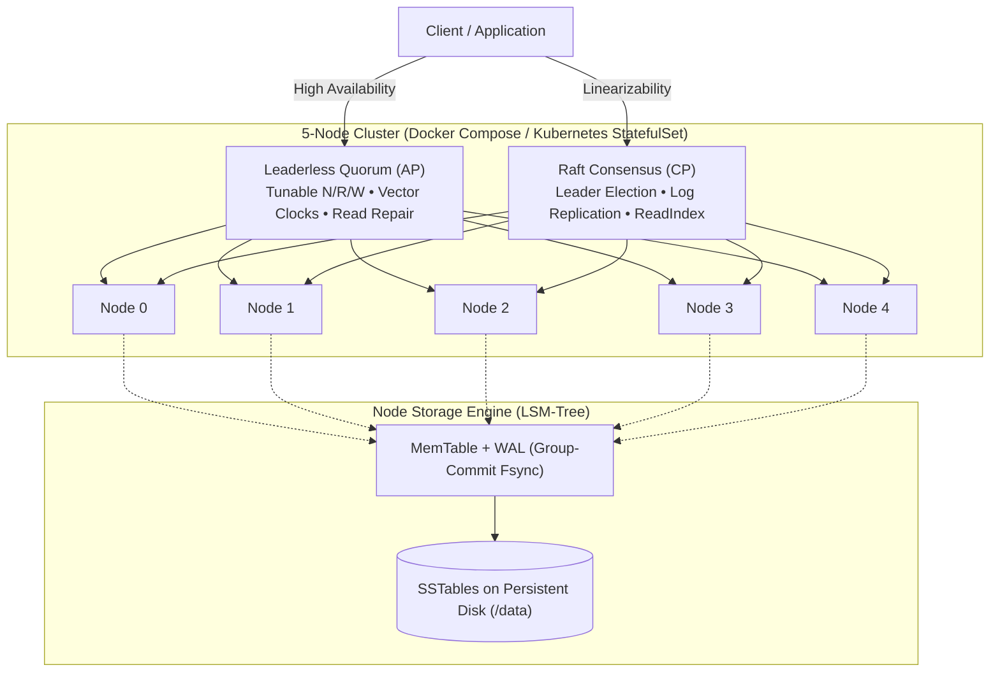

# LedgerKV

[](https://github.com/tamirkifle/distributed-kv-database/actions/workflows/ci.yml)
[](https://adoptium.net/temurin/releases/?version=11)
[](LICENSE)

A distributed key-value store built in Java, featuring a custom LSM-tree storage engine and two consistency models: Dynamo-style leaderless quorums for high availability, and Raft consensus for linearizable strong consistency.

The project runs as a multi-node gRPC cluster with consistent hashing, background compaction, Prometheus observability, and deployment manifests for Docker Compose and Kubernetes.

---

## Design Highlights

* **Two consistency models in one engine:** Choose between Dynamo-style leaderless quorums (tunable N, R, W with vector clocks and hinted handoff) or Raft consensus for strict linearizability.
* **Custom LSM-tree storage:** Combines a Write-Ahead Log (WAL) with group-commit fsync, an in-memory MemTable, SSTables with sparse index seeks, double-hashing Bloom filters, and background compaction (size-tiered or leveled).
* **Sibling preservation on concurrent writes:** Rather than silently discarding conflicting concurrent writes, replicas store siblings with their causal context and return them to the client for resolution. Deletes replicate as versioned tombstones.
* **Linearizable reads via ReadIndex:** Raft reads query the leader's commit index and confirm lease validity with a majority heartbeat before returning, avoiding stale reads without writing dummy log entries.
* **Tail-latency controls:** Supports deadline-bounded concurrent replica fanout and speculative request hedging to mask slow or failing nodes.
* **Verified with Wing & Gong checker:** Includes deterministic partition harnesses and a formal linearizability checker to contrast Raft guarantees against quorum stale reads when W + R <= N.

---

## Architecture Overview



---

## Quick Start

Start a 5-node cluster locally with Docker Compose:

```bash
docker compose up -d --build
curl -fsS http://localhost:8080/health
```

Any node can accept reads and writes, coordinating replication across the key's preference list. Configuration is environment-driven (see `docker-compose.yml`); `k8s/` contains Kubernetes StatefulSet manifests and `scripts/` has failure-injection demos.

---

## Building and Testing

Requires Java 11 and Maven:

```bash
mvn clean compile     # Compile the project
mvn test              # Run the full test suite (410 tests)
mvn clean package     # Build a runnable jar (target/ledgerkv.jar)
```

The test suite covers unit logic, concurrency races, forked-JVM hard-crash recovery (`Runtime.halt()`), simulated network partitions, and linearizability checking.

---

## Source Layout

* [`src/main/java/com/ledgerkv/storage/`](src/main/java/com/ledgerkv/storage/): WAL binary framing, MemTable, SSTables, Bloom filter, and background compactor.
* [`src/main/java/com/ledgerkv/quorum/`](src/main/java/com/ledgerkv/quorum/): Consistent hashing ring, leaderless quorum coordinator, vector clocks, and hinted handoff.
* [`src/main/java/com/ledgerkv/raft/`](src/main/java/com/ledgerkv/raft/): Raft node role logic, log replication, snapshotting, and Raft-backed KV state machine.
* [`src/main/java/com/ledgerkv/transport/`](src/main/java/com/ledgerkv/transport/): gRPC service implementations, client connection pooling, and replica RPCs.
* [`src/main/java/com/ledgerkv/node/`](src/main/java/com/ledgerkv/node/): Application entrypoint, environment configuration, and health server.
* [`src/main/java/com/ledgerkv/metrics/`](src/main/java/com/ledgerkv/metrics/): Lightweight Prometheus text-format metrics exporter.
* [`src/main/java/com/ledgerkv/checker/`](src/main/java/com/ledgerkv/checker/): Wing & Gong linearizability search checker and partition harnesses.

---

## Observability

Every node exports Prometheus metrics on its health port at `/metrics`, tracking request counters, p50/p95/p99 latency, quorum failures, hedged requests, and read repairs.

Launch Prometheus and a pre-configured Grafana dashboard alongside the cluster:

```bash
docker compose -f docker-compose.yml -f monitoring/docker-compose.monitoring.yml up -d
```

* Grafana: `http://localhost:3000`
* Prometheus: `http://localhost:9099`

---

## Benchmarks

A YCSB-style workload generator drives JMH benchmarks and compaction-amplification profiling via the `bench` Maven profile:

```bash
mvn -Pbench -DskipTests clean package
java -jar target/benchmarks.jar -l                                        # List benchmarks
java -jar target/benchmarks.jar EngineBenchmarks                          # Engine micro-benchmarks
java -cp target/benchmarks.jar com.ledgerkv.bench.jmh.AmplificationMain   # Compaction amplification
```

---

## Limitations

* **Tombstones are retained:** Deletes replicate as versioned tombstones that remain in storage indefinitely, similar to Cassandra without a `gc_grace_seconds` compaction reaper.
* **Coordination read round-trip:** The coordinator reads the key's existing causal context from replicas before stamping a new write version.
* **No dynamic membership:** Raft group membership is fixed at node startup. Joint consensus and dynamic cluster reconfiguration are not implemented.
* **Single-shard Raft:** The Raft consensus path operates as a single replicated state machine across the cluster rather than partitioned multi-Raft shards.

---

## License

[MIT](LICENSE)
