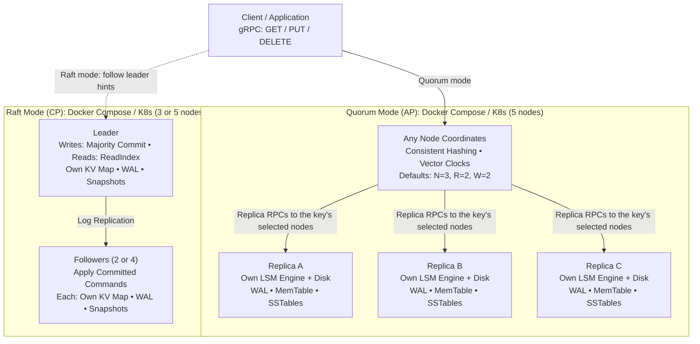

# LedgerKV

[](https://github.com/tamirkifle/distributed-kv-database/actions/workflows/ci.yml)
[](https://adoptium.net/temurin/releases/?version=11)
[](LICENSE)

A distributed key-value store built in Java, featuring a custom LSM-tree storage engine and two consistency models: Dynamo-style leaderless quorums for high availability, and Raft consensus for linearizable strong consistency.

The project runs as a multi-node gRPC cluster with consistent hashing, background compaction, Prometheus observability, and deployment manifests for Docker Compose and Kubernetes.

---

## Design Highlights

* **Two consistency models in one engine:** Choose between Dynamo-style leaderless quorums (tunable N, R, W with vector clocks and hinted handoff) or Raft consensus for strict linearizability (`LEDGERKV_MODE=quorum|raft`).
* **Custom LSM-tree storage:** Combines a Write-Ahead Log (WAL) with group-commit fsync, an in-memory MemTable, SSTables with sparse index seeks, double-hashing Bloom filters, and background compaction (size-tiered or leveled).
* **Sibling preservation on concurrent writes:** Rather than silently discarding conflicting concurrent writes, replicas store siblings with their causal context and return them to the client for resolution. Deletes replicate as versioned tombstones.
* **Linearizable reads via ReadIndex:** Raft reads query the leader's commit index and confirm lease validity with a majority heartbeat before returning, avoiding stale reads without writing dummy log entries.
* **Tail-latency controls:** Supports deadline-bounded concurrent replica fanout and speculative request hedging to mask slow or failing nodes.
* **Verified with Wing & Gong checker:** Formal linearizability search checker and deterministic partition harnesses verify zero violations across 1,560 operations in 65 test histories under leader SIGKILL and network partitions.

---

## Architecture Overview

`LEDGERKV_MODE=quorum|raft` selects the replication path at deploy time. Quorum is the default. A deployment runs one mode: they use different storage, and a data directory records which mode wrote it so a node started in the wrong one refuses to boot rather than serving an empty keyspace.



The leaderless path shows one key's three preferred replicas; other keys may map to different nodes, and the coordinator can itself be a replica. Each replica writes to its own WAL and MemTable, then flushes the MemTable to SSTables on its own disk.

In Raft mode every member holds the full keyspace in an in-memory map backed by its own durable Raft log and snapshots; three of five members must have a write before it is acknowledged. Only the leader serves. A follower answers with the leader's endpoint instead, so a client reaches the leader in at most two hops. Raft is not connected to the LSM engine: in Raft mode no engine is opened at all.

### Source Layout

* [`src/main/java/com/ledgerkv/storage/`](src/main/java/com/ledgerkv/storage/): WAL binary framing, MemTable, SSTables, Bloom filter, and background compactor.
* [`src/main/java/com/ledgerkv/quorum/`](src/main/java/com/ledgerkv/quorum/): Consistent hashing ring, leaderless quorum coordinator, vector clocks, and hinted handoff.
* [`src/main/java/com/ledgerkv/raft/`](src/main/java/com/ledgerkv/raft/): Raft node role logic, log replication, snapshotting, and Raft-backed KV state machine.
* [`src/main/java/com/ledgerkv/transport/`](src/main/java/com/ledgerkv/transport/): gRPC service implementations, client connection pooling, and replica RPCs.
* [`src/main/java/com/ledgerkv/node/`](src/main/java/com/ledgerkv/node/): Application entrypoint, mode selection, environment configuration, the Raft runtime, and the health server.
* [`src/main/java/com/ledgerkv/metrics/`](src/main/java/com/ledgerkv/metrics/): Lightweight Prometheus text-format metrics exporter.
* [`src/main/java/com/ledgerkv/checker/`](src/main/java/com/ledgerkv/checker/): Wing & Gong linearizability search checker and partition harnesses.

---

## Quick Start

### Build and test

Requires Java 11 and Maven:

```bash
mvn clean compile     # Compile the project
mvn test              # Run the full test suite (478 tests)
mvn clean package     # Build a runnable jar (target/ledgerkv.jar)
```

The test suite covers unit logic, concurrency races, forked-JVM hard-crash recovery (`Runtime.halt()`), simulated network partitions, and linearizability checking.

### Run Quorum cluster (AP)

Start a 5-node quorum cluster locally with Docker Compose:

```bash
docker compose up -d --build
curl -fsS http://localhost:8080/health
```

Any node accepts reads and writes, coordinating replication across the key's preference list.

### Run Raft cluster (CP)

Start a 5-node Raft group on separate host ports so both stacks can run side by side:

```bash
docker compose -f docker-compose.raft.yml up -d --build
curl -fsS http://localhost:8180/metrics | grep ledgerkv_raft_role
```

Raft writes carry a `client_id` and `sequence` so a retry after a timeout is deduplicated rather than applied twice. Through `grpcurl`:

```bash
grpcurl -plaintext -import-path . -proto src/main/proto/ledgerkv.proto \
  -d '{"key":"k","value":"aGVsbG8=","client_id":"demo","sequence":1}' \
  localhost:9190 ledgerkv.LedgerKvNode/Put
```

Sent to a follower, that call returns a `not_leader` field carrying the leader's endpoint; `LedgerKvClusterClient` follows the hint and reuses the sequence across retries.

### Failure demos

`scripts/demo-raft-failover.sh` kills the leader container and verifies the acknowledged write survived on the newly elected leader:

```bash
./scripts/demo-raft-failover.sh
```

Kubernetes manifests live in `k8s/` for quorum mode and `k8s/raft/` for Raft mode.

---

## Observability

Every node exports Prometheus metrics on its health port at `/metrics`, tracking request counters, p50/p95/p99 latency, quorum failures, hedged requests, and read repairs. Raft nodes add role, term, commit index, applied index, and snapshot index, so a lagging member shows up as applied trailing commit.

Three endpoints, and the distinction matters under failure:

* `/health`, `/livez`: 200 while the process is up. Restarting a healthy follower because its leader went away would take a vote away from the majority that has to elect the next one.
* `/readyz`: 200 only when the node can take part: a leader whose majority has acknowledged it recently, or a follower in recent contact with a leader. 503 otherwise, which pulls a node out of the client Service during an election or in a stranded minority.

Launch Prometheus and a pre-configured Grafana dashboard alongside the cluster:

```bash
docker compose -f docker-compose.yml -f monitoring/docker-compose.monitoring.yml up -d
```

* Grafana: `http://localhost:3000`
* Prometheus: `http://localhost:9099`

---

## Benchmarks

Measurements from fault-injection experiments on a 5-node Raft cluster:

* **Linearizability:** **0 violations** across 1,560 operations in 65 test histories (healthy, leader SIGKILL, and 3/2 partition) verified with a Wing & Gong search checker.
* **Leader failover:** **~790 ms** median write outage from leader SIGKILL to write restoration; **0 acknowledged writes lost** across 30 failover cycles.
* **Follower catch-up:** **1.6–2.4 s** median log replay resynchronization after rejoining the cluster.

For full methodology, outage distributions, and local storage engine microbenchmarks, see [`doc/BENCHMARKS.md`](doc/BENCHMARKS.md).

*Measured on an 8-core Apple Silicon Mac (macOS 24.6.0, 13.6 GB RAM, Docker 29.6.1) across 5 local containers.*

---

## Limitations

See [`doc/LIMITATIONS.md`](doc/LIMITATIONS.md) for architectural constraints, single-shard Raft write limits, heap-resident state limits, and storage tradeoffs.

---

## License

[MIT](LICENSE)
